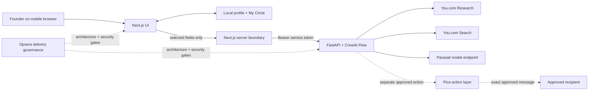

# Warm Path Map Architecture and Trust Boundaries

## System map

## Runtime boundaries

| Boundary | Data allowed across | Control |
| --- | --- | --- |
| Browser storage → UI | Complete local profile and saved Circle | Same-origin browser storage; never bulk uploaded |
| UI → Next.js proxy | Target URL; selected name, role, public URL; ask confirmation | Field-level disclosure; one to five contacts |
| Proxy → agent service | Validated request plus server-only bearer token | HTTPS except local development; 50-second timeout; generic errors |
| Agent service → You.com | Target/contact public URLs and focused public-research query | No secrets, private graph, or arbitrary user instructions |
| Candidate → Evidence Auditor | Existing claims, citations, and claim fingerprints | Auditor may approve, downgrade, or reject; cannot add a claim |
| Audited result → browser | Up to three fully cited paths | Pydantic and TypeScript validation at both boundaries |
| Browser → Pica action | Exact recipient, subject, message, literal `approved: true` | Separate confirmation after visible preview |

## Five roles with material separation

| Role | Input | Capability | Typed output |
| --- | --- | --- | --- |
| Circle Librarian | Selected disclosed fields | Validation and normalization only | `WarmPathRequest` |
| Investor Researcher | Target URL + You Research result | Normalize a target footprint | `TargetArtifact` |
| Path Scout | One contact + target + You Search result | Build ≤3-edge cited candidates | `ScoutArtifact` |
| Evidence Auditor | Candidate claims + fingerprints | Approve, downgrade, reject | `AuditArtifact` |
| Intro Strategist | Audited path only | Draft permission-first request | `IntroDraft` |

Contact scouting uses concurrent tasks only after target research completes.
Deterministic ranking then applies the approved weights: 35% evidence
completeness, 25% directness, 20% target relevance, 10% recency, and 10%
identity confidence.

## Primary threats and controls

| Threat | Control | Evidence |
| --- | --- | --- |
| Complete Circle upload | UI serializes only selected contacts | contract and browser-flow tests |
| Prompt injection in retrieved pages | Retrieved JSON is labeled untrusted; agents have fixed permissions | task prompts and no arbitrary instruction field |
| Unsupported relationship claim | Citation required on every edge; whole path drops on failure | Python and TypeScript contract tests |
| Auditor invents a better story | SHA-256 fingerprint must match an existing candidate | auditor tests |
| Identity collision | unique public URL hint; auditor downgrade/reject; strong requires ≥0.85 confidence | ranking and auditor tests |
| Secret exposure | keys only in service/web environments; raw upstream bodies suppressed | proxy tests and `.gitignore` |
| Unauthorized service calls | optional shared bearer token, constant-time comparison | service dependency |
| Autonomous outreach | `Literal[True]` approval at service; explicit checkbox at UI; separate endpoint | Pica service and proxy tests |
| Provider outage | honest 429/502/504 states; demo clearly labeled | boundary tests and UI |

## Persistence and logging

The service has no database and does not persist research history. Application
code does not log names, public profile URLs, results, recipients, or messages.
Hosting access logs should be configured to exclude request bodies. The
deterministic demo uses only simulated names and `example.com` citations.

## Deployment decision

The web app remains compatible with Cloudflare/vinext. The Python agent service
uses the Render blueprint in `render.yaml`. Render and CrewAI AMP are both
viable, but Render is the selected first deployment because the repository
already contains a portable FastAPI boundary and the special-award story is
about Opsera governance rather than a second orchestration plane.
